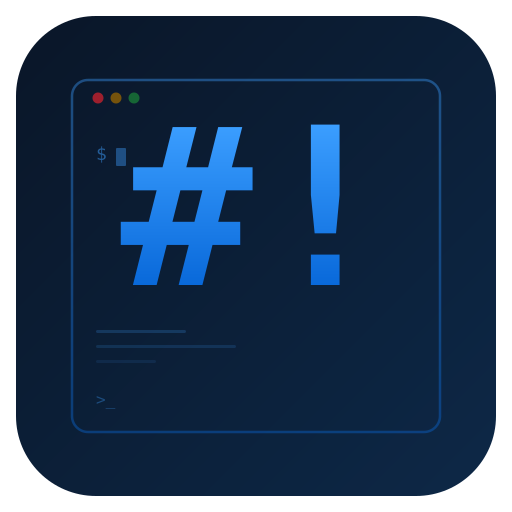

<p align="center">
  
</p>

<h1 align="center">Dev Home</h1>

<p align="center">
  A personal developer dashboard that brings JIRA, GitHub, and your notes into one place.
  <br/><br/>
  Yes, there's a chess puzzle.<br/>
  No, it won't count as a commit.
</p>

<p align="center">
  
  
</p>

---

<p align="center">
  
</p>

## Features

- Summary Dashboard
- Activity Timeline
- Team Activity
- Contribution Stats
- Leaderboard
- JIRA Notifications
- Rich Notes

## Quick Start

```bash
nvm use                                # Node 22 (see .nvmrc)
yarn install                           # installs deps + rebuilds native modules
cd server && yarn install && cd ..     # install server deps
yarn dev                               # launch the app
```

Requires [Node.js](https://nodejs.org/) 22 and [Yarn](https://yarnpkg.com/).

## Configuration

Go to **Settings** in the app and add the following:

- <details>
  <summary><strong>GitHub</strong> - Personal access token with <code>repo</code>, <code>read:org</code>, and <code>read:user</code> scopes.</summary>

  Generate one [here](https://github.com/settings/tokens).

  

  </details>

- <details>
  <summary><strong>JIRA</strong> - Base URL, email, and API token.</summary>

  Base URL is your Atlassian domain (e.g. `https://yourcompany.atlassian.net`). Generate an API token [here](https://id.atlassian.com/manage-profile/security/api-tokens).

  

  </details>

## Build and Packaging

```bash
yarn build        # compile frontend + backend
yarn dist         # build + package for current platform (output in release/)
yarn dist:mac     # build + package as macOS DMG (arm64)
```

## Screenshots

| GitHub Activity | Leaderboard | Contributions |
|---------|----------|-------|
|  |  |  |

